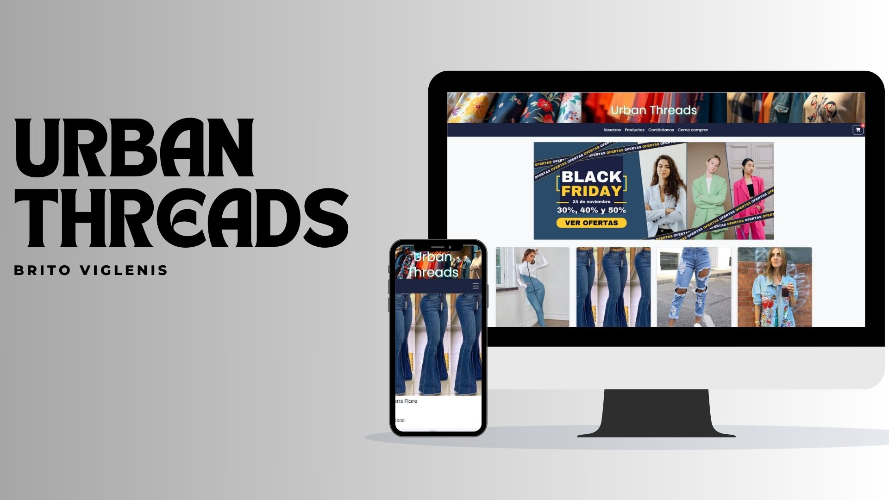
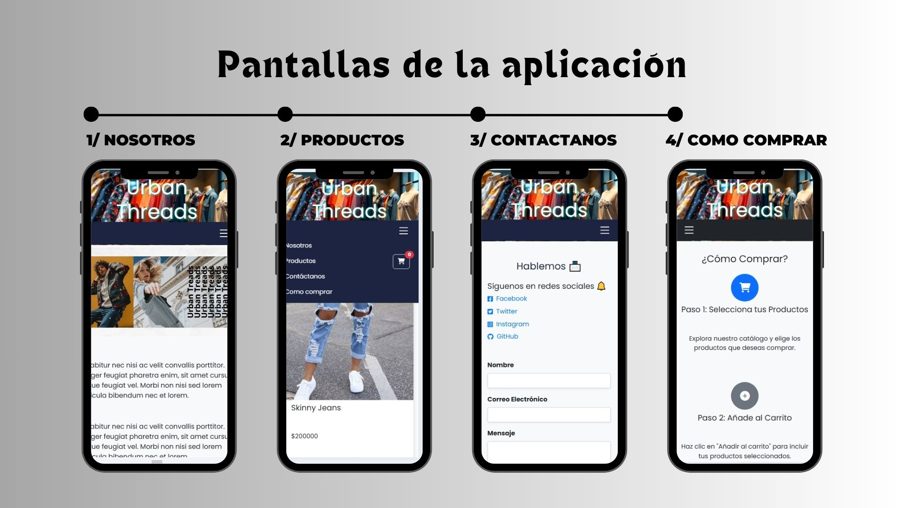

E-commerce  - Urban Threads
Descripción
Urban Threads es un sitio web de comercio electrónico diseñado para la venta de ropa. El sitio incluye varias secciones como: Nosotros, Productos, Contáctanos y Cómo Comprar. 
El sitio tiene una estructura sencilla y está diseñado para ofrecer una experiencia de usuario intuitiva y fluida.

Estructura del Proyecto
El proyecto está compuesto por varios archivos HTML y una estructura de carpetas organizada para facilitar el desarrollo y la expansión del sitio.
A continuación, se muestra una breve descripción de las principales secciones:

index.html: Página de inicio con una breve introducción acerca de la pagina y enlaces a otras secciones del sitio.
productos.html: Muestra la lista de productos disponibles, con imágenes y precios. Los usuarios pueden ver detalles y agregar productos al carrito. En el area del carrito se pueden observar
los items añadidos y proceder al pago (ahora en construccion - pago.html)
Ademas muestra las reseñas de los productos por parte de los usuarios, con un sistema de estrellas.(harcodeado)
contacto.html: Formulario de contacto que se envía a través de Formspree para permitir que los usuarios envíen consultas o comentarios.
comprar.html: Sección explicativa de cómo realizar compras en el sitio.

TP1-Habilidades/
├── css/
│   └── style.css          # Estilos principales
├── img/
│   └── (imágenes de productos y contenido)
├── index.html             # Página de inicio
├── productos.html         # Página de productos
├── contacto.html          # Página de contacto (Formspree)
└──como_comprar.html      # Página explicativa de cómo comprar

Tecnologías Utilizadas
HTML5: Estructura del sitio web.
CSS3: Diseño y estilo de la página utilizando flexbox y grid para una disposición adaptable.
JavaScript: Para interactividad del carrito, modal de reseñas, y otras funcionalidades dinámicas.
Formspree: Para el envío de formularios de contacto sin necesidad de un backend.
Font Awesome: Para los iconos utilizados en el sitio (como el carrito de compras).

Características
Responsive Design: El sitio está diseñado para ser completamente responsive, adaptándose a diferentes tamaños de pantalla, desde dispositivos móviles hasta pantallas de escritorio.
Carrito de Compras: Los usuarios pueden añadir productos al carrito, ver el total de su compra y proceder con el pago.
Sistema de Reseñas: Los usuarios pueden ver las reseñas de otros clientes y compartir su experiencia con los productos.
Formulario de Contacto: Los usuarios pueden enviar preguntas o comentarios a través del formulario de contacto integrado con Formspree.
Navegación Fluida: Cada sección (Nosotros, Productos, Contacto, Cómo Comprar) tiene su propia página y se puede acceder fácilmente desde el menú de navegación.

Instalación
Clona el repositorio a tu máquina local:
git clone https://github.com/viglenis08/TP1-Habilidades.git

Contribuciones
Las contribuciones son bienvenidas. Si deseas contribuir, por favor sigue estos pasos:

Haz un fork del repositorio.
Crea una nueva rama (git checkout -b feature/nueva-caracteristica).
Realiza tus cambios y haz commit (git commit -am 'Añadir nueva característica').
Haz push a la rama (git push origin feature/nueva-caracteristica).
Crea un nuevo Pull Request.   
# E-commerce de Ropa - Urban Threads

## Capturas de Pantalla

### Página de Inicio

### Pantalla de aplicaciones

